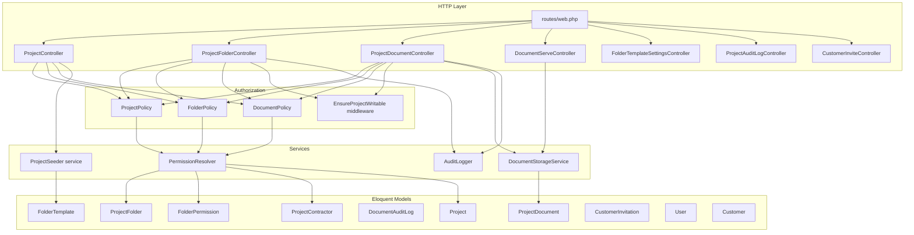
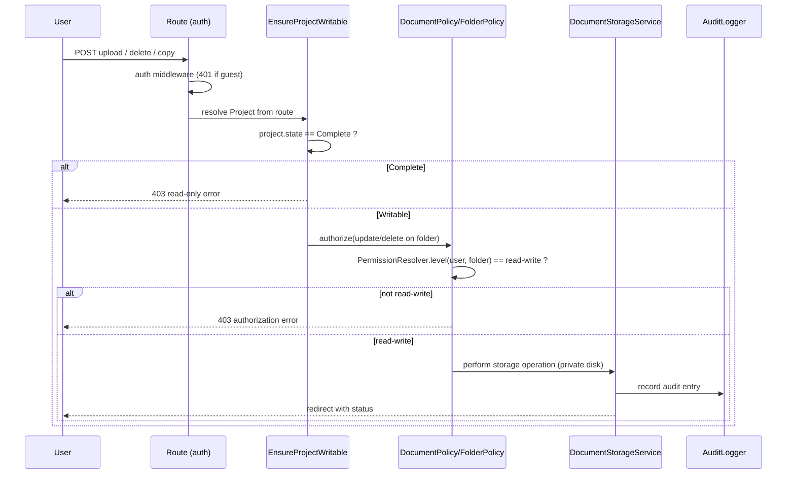
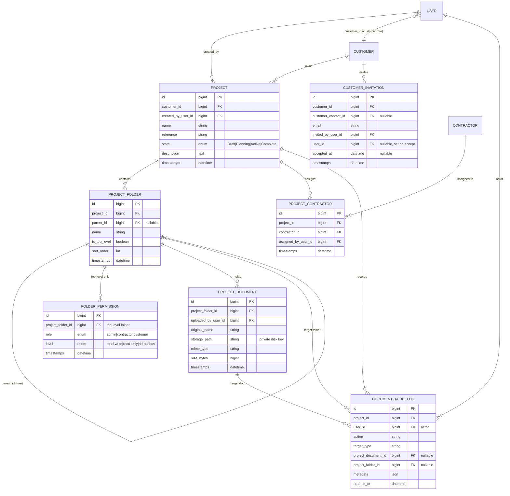
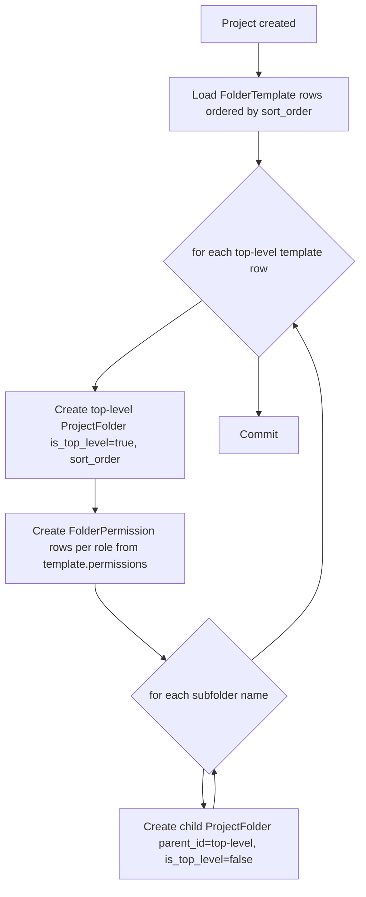
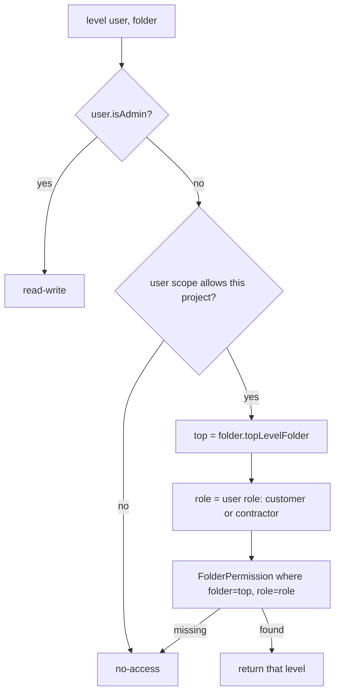
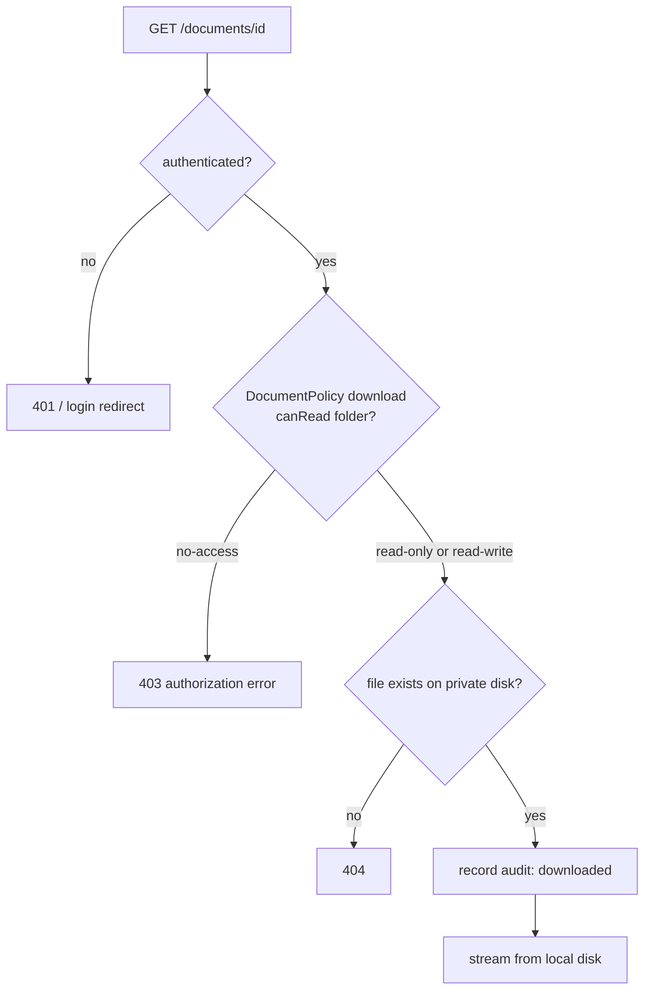

# Design Document

## Overview

The Customer Documents Portal adds a SharePoint-style, permission-controlled document library to SiteDesk (Laravel 13, PHP 8.3). Admins create Projects for Customers, each Project is seeded from an admin-configurable master folder template, and documents are stored on the private `local` disk (`storage/app/private`) and served only through an authenticated, permission-checked streaming route.

The design deliberately reuses established SiteDesk conventions:

- **Admin routing** — all management screens live under the `admin` prefix / `admin.` name group in `routes/web.php`, with controllers under `App\Http\Controllers\Admin`.
- **Settings pattern** — the master template editor mirrors `PortalSettingsController` / `SettingsHubController`, exposed under `admin.settings.*`, backed by a singleton-style settings model like `PortalSetting::current()`.
- **Customer invite flow** — mirrors `ContractorController@sendInvite`: create a `User` with a random password, then dispatch `Password::sendResetLink()` which delivers `SiteDeskResetPasswordNotification`.
- **Private storage** — documents use the private `local` disk (`serve => true`). The public-`uploads` approach used by `QuoteFileController` is explicitly **not** followed here.

Two things differ intentionally from existing code:

1. Authorization moves from inline `abort_unless(auth()->user()->isAdmin(), 403)` to **Laravel Policies** (`ProjectPolicy`, `FolderPolicy`, `DocumentPolicy`), because access here is role- *and* ownership-scoped (admin full, customer → own customer's projects, contractor → assigned projects). Inline admin checks remain acceptable for admin-only settings/audit screens.
2. Document reads/writes go through a small `DocumentStorageService` and `PermissionResolver` so the permission and read-only rules live in one place.

## Architecture

### High-level component map



### Storage disk

All documents are written to the `local` disk configured in `config/filesystems.php`:

```php
'local' => [
    'driver' => 'local',
    'root'   => storage_path('app/private'),
    'serve'  => true,   // Laravel's internal serve support; we still gate via our own route
    'throw'  => false,
],
```

Files are stored under a deterministic, non-guessable key: `projects/{project_id}/{folder_id}/{ulid}.{ext}`. Only `ProjectDocument.storage_path` (the disk-relative key) is persisted — never a public URL. The `ProjectDocument` model exposes **no** `getUrlAttribute()` accessor (contrast with `QuoteFile::getUrlAttribute()`), so no `asset()`/public URL can be generated for a document.

### Request lifecycle for a modifying document/folder operation



## Data Models

### Entity relationship diagram



### Migrations

All migrations follow the existing timestamped convention (`database/migrations/2026_..._*.php`) and use the anonymous-class + `foreignId()->constrained()` style seen in `create_customers_table`. The user-role additions extend the existing `role` column (added by `add_sitedesk_fields_to_users_table`).

**`..._add_customer_id_to_users_table.php`** — link customer-role users to a Customer.

```php
Schema::table('users', function (Blueprint $table) {
    $table->foreignId('customer_id')
        ->nullable()
        ->after('status')
        ->constrained('customers')
        ->nullOnDelete();
    $table->index('customer_id');
});
// No enum change needed: `role` is a plain string column; 'customer' is a new valid value.
```

**`..._create_folder_templates_table.php`** — master template storage (settings). Stores the whole template as ordered rows; a single logical template (mirrors the `PortalSetting::current()` singleton idea but as a set of rows).

```php
Schema::create('folder_templates', function (Blueprint $table) {
    $table->id();
    $table->string('name');            // top-level folder name
    $table->unsignedInteger('sort_order')->default(0);
    $table->json('subfolders');        // ordered list of default subfolder names
    $table->json('permissions');       // {admin, contractor, customer} => level
    $table->timestamps();
    $table->index('sort_order');
});
```

**`..._create_projects_table.php`**

```php
Schema::create('projects', function (Blueprint $table) {
    $table->id();
    $table->foreignId('customer_id')->constrained('customers')->cascadeOnDelete();
    $table->foreignId('created_by_user_id')->nullable()->constrained('users')->nullOnDelete();
    $table->string('name');
    $table->string('reference')->nullable();
    $table->string('state')->default('Draft'); // Draft|Planning|Active|Complete
    $table->text('description')->nullable();
    $table->timestamps();
    $table->index(['customer_id', 'state']);
});
```

**`..._create_project_folders_table.php`** — self-referential tree with a `is_top_level` flag.

```php
Schema::create('project_folders', function (Blueprint $table) {
    $table->id();
    $table->foreignId('project_id')->constrained('projects')->cascadeOnDelete();
    $table->foreignId('parent_id')->nullable()->constrained('project_folders')->cascadeOnDelete();
    $table->string('name');
    $table->boolean('is_top_level')->default(false);
    $table->unsignedInteger('sort_order')->default(0);
    $table->timestamps();
    $table->index(['project_id', 'parent_id', 'sort_order']);
});
```

**`..._create_folder_permissions_table.php`** — one row per (top-level folder, role). Only top-level folders carry permission rows; subfolders inherit.

```php
Schema::create('folder_permissions', function (Blueprint $table) {
    $table->id();
    $table->foreignId('project_folder_id')->constrained('project_folders')->cascadeOnDelete();
    $table->string('role');   // admin|contractor|customer
    $table->string('level');  // read-write|read-only|no-access
    $table->timestamps();
    $table->unique(['project_folder_id', 'role']);
});
```

**`..._create_project_documents_table.php`**

```php
Schema::create('project_documents', function (Blueprint $table) {
    $table->id();
    $table->foreignId('project_folder_id')->constrained('project_folders')->cascadeOnDelete();
    $table->foreignId('uploaded_by_user_id')->nullable()->constrained('users')->nullOnDelete();
    $table->string('original_name');
    $table->string('storage_path');   // private disk key, never a URL
    $table->string('mime_type')->nullable();
    $table->unsignedBigInteger('size_bytes')->default(0);
    $table->timestamps();
    $table->index('project_folder_id');
});
```

**`..._create_project_contractors_table.php`** — pivot for contractor assignment.

```php
Schema::create('project_contractors', function (Blueprint $table) {
    $table->id();
    $table->foreignId('project_id')->constrained('projects')->cascadeOnDelete();
    $table->foreignId('contractor_id')->constrained('contractors')->cascadeOnDelete();
    $table->foreignId('assigned_by_user_id')->nullable()->constrained('users')->nullOnDelete();
    $table->timestamps();
    $table->unique(['project_id', 'contractor_id']);
});
```

**`..._create_document_audit_logs_table.php`**

```php
Schema::create('document_audit_logs', function (Blueprint $table) {
    $table->id();
    $table->foreignId('project_id')->constrained('projects')->cascadeOnDelete();
    $table->foreignId('user_id')->nullable()->constrained('users')->nullOnDelete();
    $table->string('action');       // uploaded|downloaded|deleted|copied|folder_created|folder_renamed|folder_reordered|folder_deleted
    $table->string('target_type');  // document|folder
    $table->foreignId('project_document_id')->nullable()->constrained('project_documents')->nullOnDelete();
    $table->foreignId('project_folder_id')->nullable()->constrained('project_folders')->nullOnDelete();
    $table->json('metadata')->nullable();
    $table->timestamp('created_at')->useCurrent();
    $table->index(['project_id', 'created_at']);
});
```

**`..._create_customer_invitations_table.php`** — mirrors the intent of `contractor_invitations` but with the real columns the flow needs.

```php
Schema::create('customer_invitations', function (Blueprint $table) {
    $table->id();
    $table->foreignId('customer_id')->constrained('customers')->cascadeOnDelete();
    $table->foreignId('customer_contact_id')->nullable()->constrained('customer_contacts')->nullOnDelete();
    $table->string('email');
    $table->foreignId('invited_by_user_id')->nullable()->constrained('users')->nullOnDelete();
    $table->foreignId('user_id')->nullable()->constrained('users')->nullOnDelete();
    $table->timestamp('accepted_at')->nullable();
    $table->timestamps();
    $table->index(['customer_id', 'email']);
});
```

### Eloquent models

**`User`** — extend the existing model. Add `customer_id` to fillable, a `customer()` relation, an `isCustomer()` helper, and a `projects` accessor via customer.

```php
public function isCustomer(): bool
{
    return $this->role === 'customer';
}

public function customer(): BelongsTo
{
    return $this->belongsTo(Customer::class);
}
```

**`Project`**

```php
class Project extends Model
{
    protected $fillable = ['customer_id', 'created_by_user_id', 'name', 'reference', 'state', 'description'];

    public const STATES = ['Draft', 'Planning', 'Active', 'Complete'];

    public function customer(): BelongsTo { return $this->belongsTo(Customer::class); }
    public function folders(): HasMany { return $this->hasMany(ProjectFolder::class); }
    public function topLevelFolders(): HasMany {
        return $this->hasMany(ProjectFolder::class)->where('is_top_level', true)->orderBy('sort_order');
    }
    public function documents(): HasManyThrough {
        return $this->hasManyThrough(ProjectDocument::class, ProjectFolder::class);
    }
    public function contractors(): BelongsToMany {
        return $this->belongsToMany(Contractor::class, 'project_contractors')->withTimestamps();
    }
    public function auditLogs(): HasMany { return $this->hasMany(DocumentAuditLog::class); }

    public function isComplete(): bool { return $this->state === 'Complete'; }
}
```

**`ProjectFolder`** — self-referential tree with helpers to walk to the top-level folder.

```php
class ProjectFolder extends Model
{
    protected $fillable = ['project_id', 'parent_id', 'name', 'is_top_level', 'sort_order'];
    protected $casts = ['is_top_level' => 'boolean'];

    public function project(): BelongsTo { return $this->belongsTo(Project::class); }
    public function parent(): BelongsTo { return $this->belongsTo(self::class, 'parent_id'); }
    public function children(): HasMany { return $this->hasMany(self::class, 'parent_id')->orderBy('sort_order'); }
    public function documents(): HasMany { return $this->hasMany(ProjectDocument::class); }
    public function permissions(): HasMany { return $this->hasMany(FolderPermission::class); }

    /** Walk up to the top-level ancestor that carries the permission rows. */
    public function topLevelFolder(): self
    {
        $node = $this;
        while (! $node->is_top_level && $node->parent) {
            $node = $node->parent;
        }
        return $node;
    }
}
```

**`FolderPermission`**, **`ProjectDocument`**, **`ProjectContractor`** (or use the pivot directly), **`DocumentAuditLog`**, **`FolderTemplate`**, and **`CustomerInvitation`** follow the same conventions with `belongsTo`/`hasMany` relations matching the ERD. `ProjectDocument` deliberately omits any URL accessor.

## Master Folder Template & Seeding

### Template storage (settings)

`FolderTemplate` rows represent the master template. A `FolderTemplateService` provides `all()` (ordered) and `sync(array $folders)` for the settings screen, analogous to how `PortalSetting::current()` centralizes settings access. Each row stores its ordered `subfolders` (JSON) and its `permissions` map (JSON) `{admin, contractor, customer} => level`.

### Default seed structure

A database seeder (`FolderTemplateSeeder`) initializes the five top-level folders in order, with the default subfolders and permissions from the requirements. Structured representation:

```php
public const DEFAULT_TEMPLATE = [
    [
        'name' => 'Planning and Design docs',
        'subfolders' => ['Drawings', 'Plans', 'Specifications'],
        'permissions' => ['admin' => 'read-write', 'contractor' => 'read-only', 'customer' => 'read-only'],
    ],
    [
        'name' => 'Quotes',
        'subfolders' => ['Issued', 'Accepted'],
        'permissions' => ['admin' => 'read-write', 'contractor' => 'no-access', 'customer' => 'read-only'],
    ],
    [
        'name' => 'Build Stage',
        'subfolders' => ['Progress', 'Photos', 'Certificates'],
        'permissions' => ['admin' => 'read-write', 'contractor' => 'read-only', 'customer' => 'read-only'],
    ],
    [
        'name' => 'Health and Safety',
        'subfolders' => ['Risk Assessments', 'Method Statements'],
        'permissions' => ['admin' => 'read-write', 'contractor' => 'read-only', 'customer' => 'read-only'],
    ],
    [
        'name' => 'SiteDesk Admin Only',
        'subfolders' => ['Internal'],
        'permissions' => ['admin' => 'read-write', 'contractor' => 'no-access', 'customer' => 'no-access'],
    ],
];
```

> The specific subfolder names above are the seeded defaults; requirement 4.7 requires each top-level folder to get its default subfolders — the exact set is confirmed at implementation and remains admin-editable afterward.

### Seeding on project creation

`ProjectSeeder::seed(Project $project)` runs inside a DB transaction when a project is created:



Subfolders never get their own `folder_permissions` rows; they inherit from their top-level ancestor at resolution time.

## Permission Resolution

Effective access is `level(user, folder)` returning one of `read-write | read-only | no-access`.



Project-scope check (step C):

- **admin** → always in scope.
- **customer** → `project.customer_id === user.customer_id`.
- **contractor** → contractor is in `project_contractors` for that project.

`PermissionResolver` methods:

- `level(User $user, ProjectFolder $folder): string`
- `canRead(User $user, ProjectFolder $folder): bool` → level !== `no-access`
- `canWrite(User $user, ProjectFolder $folder): bool` → level === `read-write`
- `visibleTopLevelFolders(User $user, Project $project): Collection` → top-level folders whose resolved level !== `no-access` (used for browsing; a `no-access` top-level folder hides its whole subtree).

Because subfolders resolve through `topLevelFolder()`, any subfolder's effective level always equals its top-level ancestor's level (requirements 4.4, 5.4, 9.4).

## Authorization: Policies & Read-Only Enforcement

### Policies

Registered in `AppServiceProvider::boot()` via `Gate::policy(...)` (or auto-discovery). They delegate ownership/permission logic to `PermissionResolver`.

- **`ProjectPolicy`**
  - `create`, `update`, `changeState`, `manage`, `viewAudit` → admin only.
  - `view` → admin, or customer owning the project, or assigned contractor.
- **`FolderPolicy`**
  - `view(user, folder)` → `PermissionResolver::canRead`.
  - `manage(user, folder)` → admin only (per-project folder management is admin-restricted, req 5.5) **and** project not Complete.
  - `createSubfolder(user, folder)` → `canWrite` and project not Complete.
- **`DocumentPolicy`**
  - `view/download(user, document)` → `canRead(document.folder)`.
  - `upload(user, folder)` / `delete(user, document)` / `copy(user, destinationFolder)` → `canWrite` and project not Complete.

Admin-only settings and audit screens keep the lightweight inline `abort_unless(auth()->user()->isAdmin(), 403)` used across existing admin controllers, for consistency.

### Read-only enforcement for Complete projects

A route middleware `EnsureProjectWritable` resolves the `Project` from the route and aborts `403` (read-only error) if `state === 'Complete'`, applied to all folder/document *modifying* routes. Policy methods that gate writes also re-check `! $project->isComplete()` as defense in depth, so both the middleware and the policy enforce req 2.1/2.2/2.4. Read/download routes are **not** wrapped by this middleware, so downloading from a Complete project remains allowed (req 2.3).

## Controllers & Routes

All routes are added inside the existing `Route::middleware(['auth'])->prefix('admin')->name('admin.')` group in `routes/web.php`, except the shared document-serving and browsing routes that must be reachable by customer/contractor users (those sit under `auth` but not under `admin.`, so a customer portal can link to them). Route-model binding is used throughout.

### Admin: Projects

| Method | URI | Name | Action |
| --- | --- | --- | --- |
| GET | `/admin/projects` | `admin.projects.index` | `ProjectController@index` |
| GET | `/admin/projects/create` | `admin.projects.create` | `ProjectController@create` (accepts optional `?customer_id=` to pre-select the Customer) |
| POST | `/admin/projects` | `admin.projects.store` | `ProjectController@store` (seeds from template, state=Draft) |
| GET | `/admin/projects/{project}` | `admin.projects.show` | `ProjectController@show` |
| GET | `/admin/projects/{project}/edit` | `admin.projects.edit` | `ProjectController@edit` |
| PUT | `/admin/projects/{project}` | `admin.projects.update` | `ProjectController@update` |
| PUT | `/admin/projects/{project}/state` | `admin.projects.state.update` | `ProjectController@updateState` |
| POST | `/admin/projects/{project}/contractors` | `admin.projects.contractors.store` | assign contractor |
| DELETE | `/admin/projects/{project}/contractors/{contractor}` | `admin.projects.contractors.destroy` | unassign |

### Project discovery & navigation (Requirement 11)

Two navigation surfaces make Projects reachable from where admins already work. No new routes are required — both reuse the existing `admin.projects.*` routes above.

**Customer record (`admin/customers/show`).** `CustomerController@show` additionally loads the Customer's Projects (`$customer->projects()->latest()->get()`, via a new `Customer::projects()` `hasMany`). The view renders a "Projects" table (name, state, created, Open link) mirroring the existing "Current quotes" section, plus a "Create project" action linking to `route('admin.projects.create', ['customer_id' => $customer->id])`. `ProjectController@create` reads the optional `customer_id` query parameter and pre-selects it in the customer dropdown (validating it exists); `store` already accepts `customer_id`, so no store change is needed. This satisfies req 1.7, 11.1, 11.2.

**Main dashboard.** The dashboard route is served by `DashboardController@index` (returning the `dashboard` view). The disabled "Jobs" placeholder card is replaced by a working **Projects tile** in the existing admin tools grid (matching the Contractors/Customers/Quotes tiles), shown only inside the dashboard's `@if ($user->isAdmin())` block and guarded with `Route::has('admin.projects.index')`. The tile links to the existing Projects list page `admin.projects.index` (`/admin/projects`) — which is where the full paginated Projects table lives (name, customer, state, created, Open; admin-only via `ProjectController@index`'s `abort_unless(isAdmin)`). Non-admins never see the tile (req 11.5). This keeps the dashboard a uniform grid of tiles and gives the Projects table its own dedicated page (req 11.3, 11.4).

### Admin: Per-project folder management

| Method | URI | Name | Action |
| --- | --- | --- | --- |
| POST | `/admin/projects/{project}/folders` | `admin.projects.folders.store` | create top-level/sub folder |
| PUT | `/admin/projects/{project}/folders/{folder}` | `admin.projects.folders.update` | rename |
| PUT | `/admin/projects/{project}/folders/reorder` | `admin.projects.folders.reorder` | reorder |
| DELETE | `/admin/projects/{project}/folders/{folder}` | `admin.projects.folders.destroy` | delete |
| PUT | `/admin/projects/{project}/folders/{folder}/permissions` | `admin.projects.folders.permissions.update` | set role levels (top-level only) |

All wrapped with `EnsureProjectWritable`.

### Admin: Master folder template settings

Mirrors `PortalSettingsController` routing (`admin.settings.*`), and gets a card on the settings hub (`SettingsHubController`).

| Method | URI | Name | Action |
| --- | --- | --- | --- |
| GET | `/admin/settings/folder-template` | `admin.settings.folder-template.edit` | `FolderTemplateSettingsController@edit` |
| PUT | `/admin/settings/folder-template` | `admin.settings.folder-template.update` | `FolderTemplateSettingsController@update` |

### Documents (admin + customer + contractor)

Browsing and serving live under `auth` (reachable by all authorized roles); modifying ops under `admin` + `EnsureProjectWritable`.

| Method | URI | Name | Action |
| --- | --- | --- | --- |
| GET | `/projects/{project}/library` | `projects.library` | `ProjectLibraryController@show` (permission-filtered tree) |
| GET | `/projects/{project}/folders/{folder}` | `projects.folders.show` | `ProjectLibraryController@folder` |
| GET | `/documents/{document}` | `documents.serve` | `DocumentServeController@show` (stream) |
| POST | `/admin/projects/{project}/folders/{folder}/documents` | `admin.projects.documents.store` | upload |
| DELETE | `/admin/projects/{project}/documents/{document}` | `admin.projects.documents.destroy` | delete |
| POST | `/admin/projects/{project}/documents/{document}/copy` | `admin.projects.documents.copy` | copy into destination folder |

> Upload/delete/copy are shown under `admin` because per-project management is admin-restricted (reqs 5, 9.5 for structural ops). Where a non-admin `read-write` user must upload (req 7.1), the same store route can be lifted out of the `admin.` group and gated purely by `DocumentPolicy@upload` + `EnsureProjectWritable`; the policy check is the source of truth either way.

### Admin: Audit log

| Method | URI | Name | Action |
| --- | --- | --- | --- |
| GET | `/admin/projects/{project}/audit-log` | `admin.projects.audit-log.index` | `ProjectAuditLogController@index` (admin only) |

### Customer invite flow

Mirrors `ContractorController@sendInvite`. Lives under the customer admin screens.

| Method | URI | Name | Action |
| --- | --- | --- | --- |
| POST | `/admin/customers/{customer}/invite` | `admin.customers.invite` | `CustomerInviteController@send` |

```php
public function send(Request $request, Customer $customer)
{
    abort_unless(auth()->user()->isAdmin(), 403);

    $validated = $request->validate([
        'email' => ['required', 'email', 'max:255'],
        'name'  => ['required', 'string', 'max:255'],
        'customer_contact_id' => ['nullable', 'exists:customer_contacts,id'],
    ]);

    $user = User::where('email', $validated['email'])->first()
        ?? User::create([
            'name' => $validated['name'],
            'email' => $validated['email'],
            'password' => Hash::make(Str::random(40)),
            'role' => 'customer',
            'status' => 'active',
            'customer_id' => $customer->id,
        ]);

    CustomerInvitation::create([
        'customer_id' => $customer->id,
        'customer_contact_id' => $validated['customer_contact_id'] ?? null,
        'email' => $user->email,
        'invited_by_user_id' => auth()->id(),
        'user_id' => $user->id,
    ]);

    Password::sendResetLink(['email' => $user->email]); // delivers SiteDeskResetPasswordNotification

    return redirect()->route('admin.customers.show', $customer)
        ->with('status', 'Customer invite/password setup email sent.');
}
```

Acceptance (set-password) reuses the existing password reset flow; on first successful reset the customer user is already linked to the Customer via `customer_id`.

## Secure Document Serving

`DocumentServeController@show` is the *only* way to read a document's bytes:

```php
public function show(ProjectDocument $document)
{
    // auth middleware already guarantees an authenticated user (401/redirect for guests -> req 8.4)
    $this->authorize('download', $document); // DocumentPolicy -> PermissionResolver::canRead (403 on no-access -> req 8.5)

    $disk = Storage::disk('local'); // private disk, storage/app/private
    abort_unless($disk->exists($document->storage_path), 404);

    AuditLogger::documentDownloaded($document);

    return $disk->download($document->storage_path, $document->original_name, [
        'Content-Type' => $document->mime_type ?? 'application/octet-stream',
    ]);
}
```



Because the file never lives on the `public` disk and `ProjectDocument` exposes no URL accessor, no public/`asset()` URL to a document can be produced (req 8.6). `DocumentStorageService` centralizes `store`, `copy`, and `delete` against the `local` disk.

## Views / UI (Blade + existing admin layout)

Admin screens extend the existing `layouts.app` (as `admin.contractors`, `admin.customers` do) and add a settings-hub card like the existing settings pages.

- `resources/views/admin/projects/` — `index` (project + customer + state, req 1.6), `create`, `edit`, `show` (library tree, contractor assignment, links to audit log).
- `resources/views/admin/projects/folders/` — folder management partials (create/rename/reorder, permission matrix for the three roles).
- `resources/views/admin/settings/folder-template.blade.php` — master template editor (add/remove/reorder top-level folders, per-role permission matrix), reached from `admin.settings.index` hub.
- `resources/views/admin/projects/audit-log.blade.php` — audit entries table (actor, action, target, timestamp).
- `resources/views/portal/` — customer/contractor portal: `projects/index` (their accessible projects) and `library` (permission-filtered folder tree + documents, download links to `documents.serve`). Reuses `layouts.app`; navigation is role-aware.

Upload forms post `multipart/form-data`; download links point at `route('documents.serve', $document)` only.

## Error Handling

- **Authentication** — `auth` middleware handles guests (redirect to login / 401 for API), satisfying req 8.4.
- **Authorization** — policies throw `AuthorizationException` → `403`. Applies to project management (1.5), cross-customer access (3.6/6.4), write-without-permission (7.3/9.5), and no-access serving (8.5).
- **Read-only** — `EnsureProjectWritable` aborts `403` with a "project is read-only" message for Complete projects (2.4).
- **Validation** — `FormRequest`/`$request->validate()` for upload size/type (7.4) and template/project inputs; failures return `422`/redirect-back with errors.
- **Missing file** — `404` if a persisted document's disk key is absent.
- **Seeding** — wrapped in a transaction; on failure the project creation rolls back so no partially-seeded library is left.

## Testing Strategy

Feature tests (Laravel `TestCase` with `RefreshDatabase`) drive the HTTP layer; `Storage::fake('local')` and `Notification::fake()` isolate side effects. Both example-based and property-based tests are used.

- **Permission resolution** (property): random folder trees + random role/level matrices; assert every subfolder resolves to its top-level ancestor's level and browsing shows exactly the non-`no-access` folders.
- **Authorization** (property/feature): users of each role/ownership combination attempt project/folder/document actions; assert admin-only, customer-owns-only, contractor-assigned-only outcomes.
- **Secure serving** (feature + property): guests get redirected/401; `no-access` users get 403; authorized users receive the exact stored bytes; assert no public URL accessor exists and files are only on the private disk.
- **Seeding** (property + example): random master templates seed matching project trees (names, order, subfolders, permissions); default seeder produces the five named folders with the specified defaults.
- **Read-only enforcement** (property): all modifying document/folder ops on a `Complete` project are rejected; downloads still succeed.
- **Audit log** (feature): each document/folder op writes an entry with actor/action/target/timestamp; non-admins cannot view the log.

**Property test configuration:** minimum 100 iterations per property test; each test tagged `Feature: customer-documents-portal, Property {n}: {text}`. PHP property generators use a lightweight generator harness (custom `faker`-driven loops, or `pestphp/pest-plugin-faker`-style data providers) since the project has no dedicated PBT library; each property test loops ≥100 randomized cases.

## Correctness Properties

*A property is a characteristic or behavior that should hold true across all valid executions of a system-essentially, a formal statement about what the system should do. Properties serve as the bridge between human-readable specifications and machine-verifiable correctness guarantees.*

### Property 1: New projects start in Draft with exactly one customer

*For any* valid new-project submission by an admin, the created Project has `state = Draft` and is associated with exactly the one selected Customer.

**Validates: Requirements 1.1, 1.2**

### Property 2: State changes persist the selected valid state

*For any* Project and *any* state value in `{Draft, Planning, Active, Complete}`, applying a state change and reloading the Project yields exactly the selected state.

**Validates: Requirements 1.3**

### Property 3: Project management is admin-only

*For any* user whose role is not `admin`, requests to create a Project or change a Project's state are denied with an authorization error.

**Validates: Requirements 1.4, 1.5**

### Property 4: Complete projects reject all modifying operations

*For any* Project with `state = Complete` and *any* modifying operation (document upload, delete, copy, move; folder create, rename, reorder, delete), the operation is denied with a read-only error.

**Validates: Requirements 2.1, 2.2, 2.4**

### Property 5: Complete projects still allow reading and downloading

*For any* Project with `state = Complete` and *any* user holding at least `read-only` for the containing Folder, reading and downloading Documents succeed.

**Validates: Requirements 2.3**

### Property 6: Invite creates a customer-role user linked to the customer

*For any* customer contact invited by an admin, a pending Customer_User invitation is created and, upon acceptance, the resulting User has role `customer` and is associated with that Customer.

**Validates: Requirements 3.2, 3.3**

### Property 7: Access is scoped to owned / assigned projects

*For any* customer user and *any* Project, access is granted if and only if `project.customer_id == user.customer_id`; and *for any* contractor and *any* Project, access is granted if and only if the contractor is assigned to that Project.

**Validates: Requirements 3.5, 3.6, 3.7**

### Property 8: Master template save round-trips

*For any* master template (set of top-level folders, their order, and per-role permission levels), saving then reloading the template yields the identical set, order, and permission levels.

**Validates: Requirements 4.2, 4.3**

### Property 9: Master template configuration is admin-only

*For any* user whose role is not `admin`, requests to configure the master folder template are denied with an authorization error.

**Validates: Requirements 4.4**

### Property 10: Project libraries are seeded faithfully from the master template

*For any* master template, creating a Project produces a document library whose top-level folders, their order, their subfolders, and their per-role permission levels match the template.

**Validates: Requirements 4.5**

### Property 11: Subfolders inherit their top-level folder's permission

*For any* Folder tree and *any* subfolder within it, the effective Permission_Level resolved for a role equals the Permission_Level of that subfolder's top-level ancestor Folder; newly created subfolders resolve to the same level.

**Validates: Requirements 5.4, 9.4**

### Property 12: Per-project folder management is admin-only and blocked when Complete

*For any* user whose role is not `admin`, per-project folder management (add, rename, reorder, remove top-level folders; set permissions; create subfolders) is denied; and *for any* admin, these succeed only while the Project's state is not `Complete`.

**Validates: Requirements 5.1, 5.2, 5.5**

### Property 13: Browsing shows exactly the folders a role may read

*For any* user and *any* Project, the browsable set of Folders is exactly those Folders whose resolved Permission_Level is not `no-access`; a `no-access` top-level Folder excludes its entire subtree and its Documents, and a direct request for a `no-access` Folder is denied.

**Validates: Requirements 6.1, 6.3, 6.4**

### Property 14: Uploads are stored privately and recorded in the folder

*For any* user holding `read-write` for a Folder and *any* valid file, uploading stores the file on the Private_Disk (`storage/app/private`) and creates a Document record linked to that Folder; every stored Document resides on the Private_Disk.

**Validates: Requirements 7.1, 8.1**

### Property 15: Uploads without write permission are denied

*For any* user not holding `read-write` for a Folder, attempts to upload a Document, delete a Document, copy a Document into that Folder, or create a Subfolder within it are denied with an authorization error.

**Validates: Requirements 7.3, 9.5**

### Property 16: Invalid uploads are rejected

*For any* file that exceeds the configured maximum size or is of a disallowed file type, the upload is rejected with a validation error and no file is written to the Private_Disk.

**Validates: Requirements 7.4**

### Property 17: Documents are served only through the authenticated, permission-checked route

*For any* Document: an unauthenticated request is denied with an authentication error; an authenticated request by a user with `no-access` on the containing Folder is denied with an authorization error; and an authenticated request by a user holding at least `read-only` streams the exact stored bytes.

**Validates: Requirements 8.3, 8.4, 8.5, 9.1**

### Property 18: No public URL exists for any document

*For any* Document, no publicly accessible URL is generated; the Document is reachable only via the Document_Serving_Route and its file resides only on the Private_Disk.

**Validates: Requirements 8.2, 8.6**

### Property 19: Delete removes both the record and the private file

*For any* user holding `read-write` for a Folder, deleting a Document removes the Document record and deletes the underlying file from the Private_Disk, leaving no trace of either.

**Validates: Requirements 9.2**

### Property 20: Copy duplicates the document into the destination

*For any* user holding `read-write` for a destination Folder, copying a Document creates a new Document record in the destination Folder and a new file on the Private_Disk with contents equal to the original, while the original Document remains unchanged.

**Validates: Requirements 9.3**

### Property 21: Document operations are audited

*For any* Document operation (upload, download, delete, copy), an Audit_Log entry is recorded containing the acting user, the action, the target Document, the containing Folder, and the timestamp.

**Validates: Requirements 10.1**

### Property 22: Folder operations are audited

*For any* Folder operation (create, rename, reorder, delete), an Audit_Log entry is recorded containing the acting user, the action, the target Folder, and the timestamp.

**Validates: Requirements 10.2**

### Property 23: Audit log viewing is admin-only

*For any* user whose role is not `admin`, requests to view a Project's Audit_Log are denied with an authorization error.

**Validates: Requirements 10.4**
