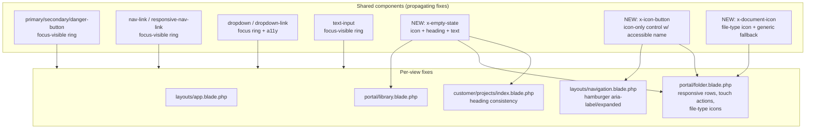

# Design

## Overview

This design improves accessibility (WCAG 2.1 AA target), mobile usability, and content consistency across the SiteDesk portal — portal-facing customer views, admin templates, and the shared Blade components they render. The recurring issues are anti-patterns that repeat across many templates, so the guiding strategy is: **centralize fixes in shared Blade components so a single change propagates to portal and admin, and apply targeted per-view fixes where the markup is local** (notably the document/folder tables in `portal/folder.blade.php`).

The work stays inside the existing visual language: square styling (`rounded-none`), a black/white/gray palette, Tailwind utilities, and Alpine.js for interactivity. No new frontend framework, build step, or CSS methodology is introduced. The single CSS entry remains `resources/css/app.css`.

### Honesty about the accessibility bar

This design targets WCAG 2.1 AA, but **full WCAG 2.1 AA conformance cannot be automatically verified**. Automated tooling and code-level checks catch a meaningful subset (missing accessible names, unpaired `focus:outline-none`, `aria-expanded` binding, hover-only actions). They cannot confirm perceptual qualities like real focus-ring contrast, screen-reader announcement quality, logical reading/focus order across assistive technologies, or true 44px rendered touch targets. Genuine conformance still requires **manual assistive-technology testing and expert accessibility review**. The Verification section states this explicitly and the reporting must not claim guaranteed compliance.

_Validates: Requirements 10.1, 10.2, 10.3_

## Architecture

### Fix placement strategy

The affected surface splits into two layers:

1. **Shared components** (`resources/views/components/*`) — reused across portal and admin. Fixes here propagate everywhere the component is rendered. This is where focus rings, accessible-name conventions, and the empty-state pattern live.
2. **Per-view markup** — layout-specific markup that is not (yet) componentized, primarily the folder/document tables in `portal/folder.blade.php` and `portal/library.blade.php`, and the navigation in `layouts/navigation.blade.php`. Fixes here are local, but where a pattern recurs (row actions, empty states) we extract a small component.



### Design principles

- **One focus-ring convention.** A single utility pattern (`focus:outline-none focus-visible:ring-2 focus-visible:ring-gray-900 focus-visible:ring-offset-2`) is applied consistently. `focus:outline-none` is never left unpaired.
- **Accessible name at the control, decorative SVG.** Icon-only controls carry the name (`aria-label` or visually hidden text); their SVGs carry `aria-hidden="true"`. `title` is supplementary, never the sole name.
- **Mobile-first for the tables.** Metadata and actions are visible on phones by default; the desktop table columns are a progressive enhancement (`sm:` and up), not a gate that hides content on small screens.
- **Minimal, in-style components.** New components reuse existing palette/shape and Alpine patterns already present in `dropdown.blade.php` and `navigation.blade.php`.

## Components and Interfaces

### 1. Focus ring convention (shared buttons, links, inputs)

The existing shared components already use `focus:outline-none`, some paired with a colored ring (`primary/secondary/danger-button` use `focus:ring-indigo-500`) and some with no visible replacement (`nav-link`, `responsive-nav-link`, `dropdown-link` use `focus:outline-none` with only text/border color changes). The navigation's inline buttons (`layouts/navigation.blade.php`) also use bare `focus:outline-none`.

Convention to apply everywhere `focus:outline-none` appears:

```
focus:outline-none focus-visible:ring-2 focus-visible:ring-gray-900 focus-visible:ring-offset-2
```

- Use `focus-visible` so a mouse click does not paint a ring, but keyboard focus does — matching common expectations and avoiding a visual regression to the current click behavior.
- Use `ring-gray-900` (not indigo) to match the black/white/gray palette. The pre-existing indigo rings on the buttons are updated to the gray palette for consistency, but keeping a visible ring is the non-negotiable part.

Affected shared components: `primary-button`, `secondary-button`, `danger-button`, `nav-link`, `responsive-nav-link`, `dropdown-link`, `text-input`. Because views render these components, the fix propagates to every portal and admin screen that uses them.

_Validates: Requirements 1.1, 1.2, 1.3_

### 2. `x-icon-button` — icon-only control with an accessible name (NEW)

A small component to standardize icon-only controls (view-in-browser, download, up-one-level, and similar). It renders either an `<a>` or `<button>`, forces an accessible name, and applies the focus ring and a touch-sized box.

```blade
{{-- resources/views/components/icon-button.blade.php --}}
@props([
    'label',            // required accessible name, e.g. "Download"
    'as' => 'a',        // 'a' or 'button'
    'href' => null,
])

@php
    $tag = $as === 'button' ? 'button' : 'a';
    // ~44px target: 40px box + focus offset; p-based sizing keeps the square look.
    $base = 'inline-flex items-center justify-center min-w-[44px] min-h-[44px] '
          . 'text-gray-500 hover:text-gray-900 '
          . 'focus:outline-none focus-visible:ring-2 focus-visible:ring-gray-900 focus-visible:ring-offset-2';
@endphp

<{{ $tag }}
    @if ($tag === 'a') href="{{ $href }}" @else type="button" @endif
    aria-label="{{ $label }}"
    {{ $attributes->merge(['class' => $base]) }}
>
    {{ $slot }} {{-- expected: an SVG with aria-hidden="true" --}}
</{{ $tag }}>
```

Usage replaces the current row-action anchors in `portal/folder.blade.php`, which today rely on `title` plus a bare SVG and `opacity-0 group-hover:opacity-100`:

```blade
<x-icon-button :href="route('documents.serve', $document)" label="View {{ $document->original_name }} in browser"
               target="_blank" rel="noopener"
               class="sm:opacity-0 sm:group-hover:opacity-100 sm:group-focus-within:opacity-100 sm:transition-opacity">
    <svg class="w-4 h-4" aria-hidden="true" ...>...</svg>
</x-icon-button>
```

Note the hover-reveal is scoped to `sm:` and up, and paired with `group-focus-within` so keyboard focus reveals it; on small screens the control is always visible (see Component 4).

_Validates: Requirements 2.1, 2.2, 2.3, 4.1, 4.2_

### 3. Accessible mobile navigation toggle (per-view: `layouts/navigation.blade.php`)

The hamburger button today has no accessible name and no state. It sits inside `<nav x-data="{ open: false, ... }">`. Changes:

```blade
<button
    @click="open = ! open"
    :aria-expanded="open.toString()"
    aria-controls="mobile-navigation"
    aria-label="Toggle navigation menu"
    class="inline-flex items-center justify-center min-w-[44px] min-h-[44px] p-2 border border-gray-300
           text-gray-600 hover:text-gray-900 hover:bg-gray-100
           focus:outline-none focus-visible:ring-2 focus-visible:ring-gray-900 focus-visible:ring-offset-2
           focus:bg-gray-100 focus:text-gray-900 transition duration-150 ease-in-out"
>
    <svg class="h-6 w-6" aria-hidden="true" ...>...</svg>
</button>
```

The mobile panel container gets the matching id:

```blade
<div id="mobile-navigation" :class="{'block': open, 'hidden': ! open}" class="hidden sm:hidden border-t border-gray-300">
```

The two nav dropdown triggers (the "Contractors" admin dropdown and the user-menu chevron) also carry bare `focus:outline-none` and icon-only chevrons; they get the focus ring and, for the chevron-only user menu, an `aria-label` ("Open user menu") with the chevron SVG marked `aria-hidden`.

_Validates: Requirements 3.1, 3.2, 3.3, 3.4, 2.1, 2.2_

### 4. Responsive, touch-friendly document/folder rows (per-view: `portal/folder.blade.php`)

Current row markup hides type/size/modified/actions with `hidden sm:block`, the header row is `hidden sm:flex`, and row actions use `opacity-0 group-hover:opacity-100` (invisible and unreachable on touch). The redesign keeps the desktop table exactly as-is at `sm:` and up, and adds a phone layout below `sm`.

Approach per document row:

- **Name + file-type icon**: always visible (unchanged position). File-type icon comes from the new `x-document-icon` (Component 5).
- **Secondary metadata line** (phone only): a stacked line beneath the name showing type · size · modified, using `sm:hidden`. The existing desktop columns keep `hidden sm:block`. This satisfies "metadata visible on phones" without disturbing the desktop table.
- **Actions**: always visible on small screens; on `sm:` and up they may keep the hover reveal, now also revealed on `group-focus-within`.

Sketch:

```blade
<div class="group flex items-center gap-3 px-4 py-2.5 hover:bg-blue-50/60">
    <div class="flex flex-1 items-center gap-3 min-w-0">
        <x-document-icon :name="$document->original_name" :mime="$document->mime_type" class="w-5 h-5 shrink-0" />
        <div class="min-w-0">
            <a href="{{ route('documents.serve', $document) }}" ... class="block text-gray-900 truncate hover:text-blue-700 hover:underline">
                {{ $document->original_name }}
            </a>
            {{-- Phone-only stacked metadata --}}
            <p class="sm:hidden mt-0.5 text-xs text-gray-500 truncate">
                {{ $fileKind($document->mime_type, $document->original_name) }}
                · {{ $formatBytes($document->size_bytes) }}
                · {{ optional($document->created_at)->format('d M Y') ?? '—' }}
            </p>
        </div>
    </div>

    {{-- Desktop columns (unchanged, still hidden on phones) --}}
    <span class="hidden sm:block w-32 ...">{{ $fileKind(...) }}</span>
    <span class="hidden sm:block w-20 ...">{{ $formatBytes(...) }}</span>
    <span class="hidden sm:block w-28 ...">{{ optional($document->created_at)->format('d M Y') ?? '—' }}</span>

    {{-- Actions: always visible on phones; hover/focus reveal on >= sm --}}
    <div class="flex justify-end items-center gap-1
                sm:w-16 sm:opacity-0 sm:group-hover:opacity-100 sm:group-focus-within:opacity-100 sm:transition-opacity">
        <x-icon-button ... label="View {{ $document->original_name }} in browser">...</x-icon-button>
        <x-icon-button ... label="Download {{ $document->original_name }}">...</x-icon-button>
    </div>
</div>
```

Key points:
- The `—` placeholders in `$formatBytes` and the date fallbacks are **preserved** (legitimate em-dash usage — empty-value placeholders).
- Subfolder rows get the same phone metadata treatment (a phone-only "Folder" line) so the header-less small-screen layout stays understandable.
- The up-one-level control in the toolbar becomes an `x-icon-button` with `label` derived from the existing `title` ("Up one level" / "Back to library").

_Validates: Requirements 5.1, 5.2, 5.3, 6.1, 6.2, 6.3, 4.2_

### 5. `x-document-icon` — file-type icon with generic fallback (NEW)

Maps a document (mime and/or filename) to a small SVG icon, with a generic document icon fallback. The icon is decorative; the file type is also shown as text (in the desktop column and the phone metadata line), so the icon is never the sole conveyor of type.

```blade
{{-- resources/views/components/document-icon.blade.php --}}
@props(['name' => '', 'mime' => null])

@php
    $ext = strtolower(pathinfo($name, PATHINFO_EXTENSION) ?: '');
    $mime = (string) $mime;

    $kind = match (true) {
        $mime === 'application/pdf' || $ext === 'pdf'                                   => 'pdf',
        str_starts_with($mime, 'image/') || in_array($ext, ['png','jpg','jpeg','gif','webp','svg']) => 'image',
        in_array($ext, ['doc','docx']) || str_contains($mime, 'word')                   => 'doc',
        in_array($ext, ['xls','xlsx','csv']) || str_contains($mime, 'sheet')            => 'sheet',
        in_array($ext, ['zip','rar','7z','tar','gz'])                                   => 'archive',
        default                                                                          => 'generic',
    };
@endphp

{{-- One <svg aria-hidden="true"> per kind; 'generic' is the fallback document glyph --}}
```

The icon-selection helper mirrors the intent of the existing `$fileKind` and `$isViewable` closures already in `portal/folder.blade.php`, so behavior is consistent with how the view already classifies files.

_Validates: Requirements 7.1, 7.2, 7.3_

### 6. `x-empty-state` — consistent empty-state pattern (NEW)

`portal/folder.blade.php` and `portal/library.blade.php` already share a nearly identical empty state (centered icon + medium heading + gray supporting sentence), while `customer/projects/index.blade.php` uses a plainer one-line empty state. Extract the shared pattern:

```blade
{{-- resources/views/components/empty-state.blade.php --}}
@props(['heading', 'message' => null])

<div class="px-4 py-16 text-center">
    <div class="mx-auto text-gray-300" aria-hidden="true">
        {{ $icon ?? '' }} {{-- optional icon slot; default document/folder glyph if omitted --}}
    </div>
    <p class="mt-3 text-sm font-medium text-gray-700">{{ $heading }}</p>
    @if ($message)
        <p class="mt-1 text-sm text-gray-500">{{ $message }}</p>
    @endif
</div>
```

Portal views render their empty branches through this component so the icon/heading/supporting-sentence structure and spacing stay identical. Copy is standardized (e.g. "No folders available" / "This folder is empty" keep their existing tone; the customer projects empty state adopts the shared three-part shape). This is a light consistency pass, not a voice rewrite.

_Validates: Requirements 8.1, 8.2, 8.3_

### 7. Heading and copy consistency (per-view)

Concrete inconsistency: `customer/projects/index.blade.php` uses header "My Projects" but an in-page `h1` "Your projects". The navigation link for customers is also "My Projects". Resolution: align the page header and `h1` to the same wording. Given the nav uses "My Projects", the `h1` is standardized to match ("My projects" / "My Projects" — pick the nav wording), keeping the supporting sentence.

Constraints on the pass:
- Preserve legitimate em-dashes: empty-value placeholders (`?: '—'`) and heading separators are left untouched.
- Scope is limited to concrete inconsistencies and standardizing headings + empty-state copy. No full voice/tone audit.

_Validates: Requirements 9.1, 9.2, 9.3_

## Data Models

No database or model changes. This feature is presentation-layer only (Blade templates, shared components, Tailwind classes). Existing view data (`$project`, `$folders`, `$subfolders`, `$documents`, `PortalSetting`) is consumed unchanged. The `$formatBytes`, `$fileKind`, and `$isViewable` closures in `portal/folder.blade.php` are retained; the new `x-document-icon` reuses the same classification intent.

## Error Handling

Presentation-only, so error handling is about graceful rendering, not exceptions:

- **Unknown/missing file type** → `x-document-icon` returns the generic document glyph (never blank, never an error).
- **Null metadata** (size, dates) → existing `—` placeholders are preserved and used.
- **Missing routes** → existing `Route::has(...)` guards remain; icon-buttons are only rendered when their route exists, exactly as today.
- **Alpine state** → the hamburger `:aria-expanded="open.toString()"` binds to the already-present `open` state; no new state is introduced, so there is no new failure mode if JS is disabled (the button still renders with a sensible static `aria-label`).

## Correctness Properties

_A property is a characteristic or behavior that should hold true across all valid executions of a system — essentially, a formal statement about what the system should do. Properties serve as the bridge between human-readable specifications and machine-verifiable correctness guarantees._

Note on scope: several acceptance criteria (real focus-ring contrast, actual 44px rendered targets, screen-reader announcement quality, reading/focus order) are perceptual and **cannot** be captured as executable properties — they are covered by the manual review in Verification. The properties below capture the code-level invariants that a Blade render/static test can check.

### Property 1: Focus indicators are never removed without replacement

For any Blade template or shared component in the affected surface, every element whose class string contains `focus:outline-none` also declares a visible focus-ring utility (`focus-visible:ring-*`) on the same element.

**Validates: Requirements 1.1, 1.2, 1.3**

### Property 2: Icon-only controls have a programmatic accessible name

For any icon-only control rendered in the navigation and the folder/library views (view, download, up-one-level, dropdown/user-menu chevron triggers), the control exposes an accessible name via `aria-label` or visually hidden text, and its icon SVG is marked `aria-hidden="true"`.

**Validates: Requirements 2.1, 2.2, 2.3**

### Property 3: Row actions are reachable without hovering on small screens

For any document row rendered in the folder view, its action controls (view, download) are present and, in the small-screen layout, are not gated solely by `opacity-0 group-hover:opacity-100`; where a hover reveal is retained on pointer devices, the actions are also revealed on keyboard focus (`group-focus-within`).

**Validates: Requirements 5.1, 5.2, 5.3**

### Property 4: Essential document metadata is present in the small-screen layout

For any document row rendered in the folder view, the file type, size, and modified date are present in the small-screen layout (not exclusively inside elements gated by `hidden sm:block`).

**Validates: Requirements 6.1, 6.2, 6.3**

### Property 5: Every document maps to a rendered file-type icon

For any document (any mime type or filename extension, including unknown, empty, or missing type), `x-document-icon` renders exactly one icon element, falling back to the generic document glyph when the type cannot be determined.

**Validates: Requirements 7.1, 7.2, 7.3**

### Property 6: Empty states render the shared three-part pattern

For any portal view empty state rendered through `x-empty-state`, the output contains a decorative icon, a heading, and (when provided) a supporting sentence, in the shared structure.

**Validates: Requirements 8.1, 8.2, 8.3**

### Property 7: Legitimate em-dash placeholders are preserved

For any empty-value placeholder in the affected views (e.g. the `—` returned by `$formatBytes(null)` and the date fallbacks in `portal/folder.blade.php`), the placeholder remains present after the consistency pass.

**Validates: Requirements 9.2**

## Testing Strategy

Complementary unit/render tests and property tests, plus an explicitly manual accessibility layer.

### Property tests (min. 100 iterations each, tagged to the design property)

Use PHP-side property testing where inputs vary meaningfully. For Blade output, render the component/view with generated inputs and assert on the produced HTML string.

- **Property 5** (document icon): generate documents with random mime types and extensions, including unknown/empty/missing, and assert exactly one icon element renders with the generic fallback used when type is undetermined. This is the strongest PBT candidate — pure input→output mapping over a large input space.
- **Property 3 / Property 4** (rows): generate folders with random collections of documents/subfolders, render `portal/folder.blade.php`, and assert for every row that actions are present (not solely hover-gated) and that type/size/modified text appears in the small-screen layout.
- Tag format for each property test: **Feature: portal-ui-accessibility-improvements, Property {number}: {property_text}**.

### Static / render assertions (example + edge based)

Some properties are best checked as static invariants over template source or single renders:

- **Property 1** (focus rings): scan affected Blade files; for every `focus:outline-none` occurrence assert a `focus-visible:ring` utility is present on the same class string. Edge case: components that render `<a>` vs `<button>`.
- **Property 2** (accessible names): render navigation and folder view; assert each icon-only control has `aria-label`/sr-only text and its SVG has `aria-hidden`.
- **Property 6** (empty state): render `x-empty-state` with and without a message; assert icon + heading (+ optional message) present.
- **Property 7** (em-dash preservation): assert the `—` placeholders still render for null size/date inputs.

### Example-based unit tests

- Hamburger toggle: `aria-label` present, `:aria-expanded` bound to `open`, `aria-controls` references `mobile-navigation` (Requirements 3.1–3.3).
- Customer projects heading: header and `h1` use the same agreed wording (Requirement 9.1).
- Touch sizing: affected controls carry the agreed sizing classes (`min-w-[44px] min-h-[44px]`) as a proxy for Requirement 4.1/4.2 (true pixel size is manual).

### Manual accessibility verification (cannot be automated)

**Full WCAG 2.1 AA conformance cannot be auto-verified.** The following require manual testing with assistive technologies and expert review, and MUST be performed before claiming conformance:

- Screen-reader passes (e.g. VoiceOver, NVGA/NVDA) confirming names, roles, and state announcements read sensibly, including the hamburger expanded/collapsed state and row actions.
- Keyboard-only navigation confirming logical focus order and that every focus indicator is actually visible with adequate contrast.
- Real touch-target measurement on representative devices (~44px).
- Color-contrast verification of the focus ring and text against actual backgrounds.

### Honest reporting

Reporting on this work MUST:
1. State that automated checks cover only a subset of WCAG 2.1 AA.
2. Distinguish automatable checks (accessible-name presence, `aria-expanded` binding, no unpaired `focus:outline-none`, icon fallback, metadata presence) from the manual checks above.
3. Avoid any claim of guaranteed WCAG compliance, and list the manual steps still outstanding.

_Validates: Requirements 10.1, 10.2, 10.3_
